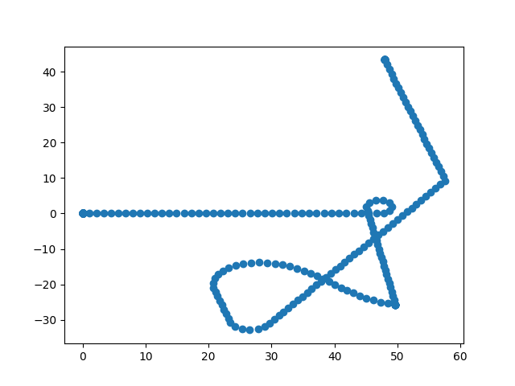
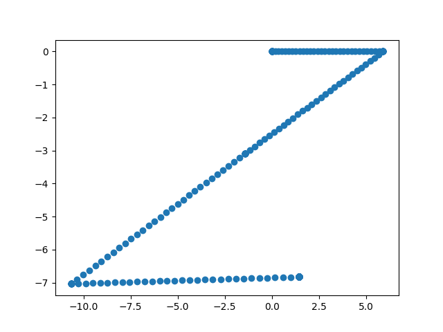

# Assignment 1

For both methods, just `ros2 run raspbot raspbot_i2c.py`

In another tab, run `ros2 run rosbridge_server rosbridge_websocket.py`

## Keyboard Teleop

On the host computer (non-py) (I tested windows), run python keyboard_input.py, making sure to update the IP to the raspbot that is being tested on.

## Square

Same procedure as the last, update the ip and then run square.py. This very much did not run in a square in the logging, as I adjusted the actual square code to do a square on the real robot, not in the log. Because of wheel slip and general motor deficiencies, this is the path it had to take to look like a square IRL.

